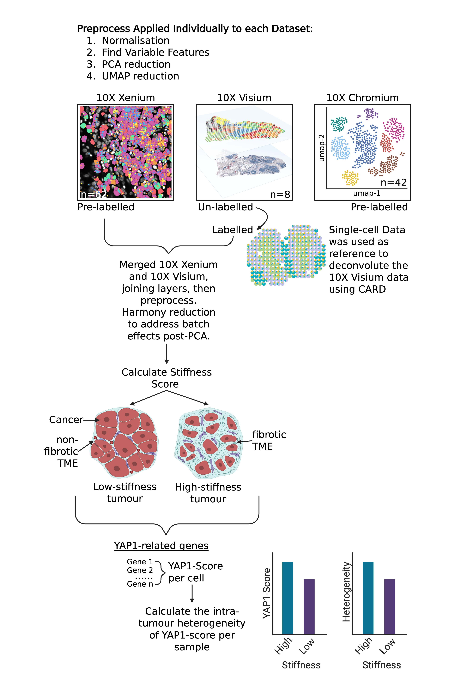

# born2YAP
Spatial Transcriptomics Analysis of YAP1 Signalling and Tissue Stiffness

    

### Background 
*This project looks at how YAP1 and its mutants YAP1-5SA and YAP1-S94A changes in cancer cells when the cancer is localised within high-stiffness tissues.*         
YAP1 (Yes-associated protein 1), also referred to as YAP or YAP65, is a transcriptional co-regulator that plays a pivotal role in the Hippo signaling pathway, a critical regulatory network governing cellular proliferation, apoptosis, and tissue homeostasis. In normal physiological conditions, the Hippo pathway phosphorylates YAP1, marking it for cytoplasmic retention or degradation, thereby suppressing its activity. However, when the Hippo pathway is inactive—a common occurrence in cancer—YAP1 translocates to the nucleus, where it partners with transcription factors such as TEAD (transcriptional enhanced associate domain) to drive the expression of pro-proliferative and anti-apoptotic genes. This aberrant activation of YAP1 contributes to tumorigenesis, making it a key focus in cancer biology.            
The mechanical microenvironment of tissues, particularly stiffness, profoundly influences YAP1 activity. Solid tumors often reside in fibrotic, high-stiffness niches, which promote YAP1 nuclear localization and oncogenic signaling. To dissect the mechanisms underlying YAP1’s role in cancer progression, researchers employ engineered mutants that alter its regulation or function. Two such mutants, YAP1-5SA and YAP1-S94A, are instrumental in studying YAP1’s behavior in mechanotransduction and tumorigenesis.            
YAP1-5SA is a hyperactive mutant generated by substituting five serine residues (phosphorylation targets of the Hippo pathway) with alanines. These mutations render YAP1 resistant to Hippo-mediated inactivation, allowing it to constitutively localize to the nucleus and drive transcription independent of upstream signals. This mutant is widely used to model persistent YAP1 activation, mimicking its oncogenic role in cancer cells.            
In contrast, YAP1-S94A carries a single point mutation (serine-94 to alanine) within its TEAD-binding domain. This mutation disrupts YAP1’s ability to interact with TEAD transcription factors, thereby abolishing the expression of YAP1-TEAD-dependent genes. YAP1-S94A serves as a critical tool to isolate the functional contribution of the YAP1-TEAD complex in processes such as proliferation and metastasis.            
By studying these mutants in high-stiffness microenvironments, researchers can elucidate how mechanical cues intersect with biochemical signaling to modulate YAP1’s oncogenic activity. This approach provides insights into potential therapeutic strategies targeting YAP1-driven cancers, particularly in stiff tissue contexts where YAP1 is pathologically activated.            

### Analysis Pipeline 

    

See the codes and project notes in the /Notes folder.             
1. [Chapter 1](codes/Chapter1_Data_Acquisition.pdf) - Data Acquisition        
2. [Chapter 2](codes/Chapter2_Preprocessing_and Annotation_of_Spatial_Transcriptomics.pdf) - Preprocessing and Annotation of Spatial Transcriptomics
3. [Chapter 3](codes/Chapter3_Fibroblast_Stiffness_&_Heterogeneity_and_YAP1_Activation_Score.pdf) - Fibroblast Stiffness & Heterogeneity, and YAP1 Activation Score
4. [Chapter 4](codes/Chapter4_Plotting.pdf) - Plotting
5. [Chapter 5](codes/Chapter5_Bulk_RNA-seq_Analysis.pdf) – Bulk RNA-seq Analysis
6. Chapter 6 – Whole Exome Sequence Analysis         

  

